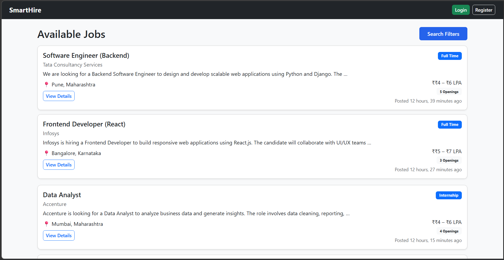
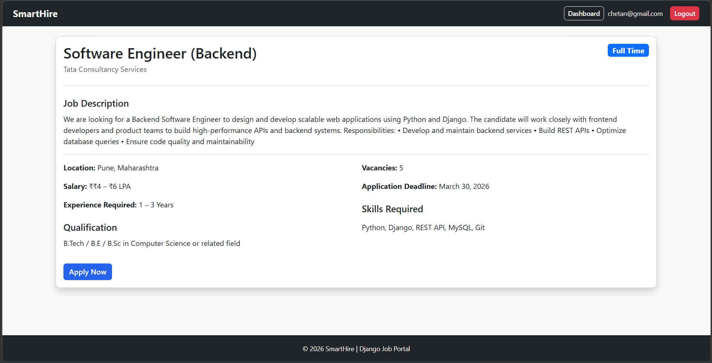
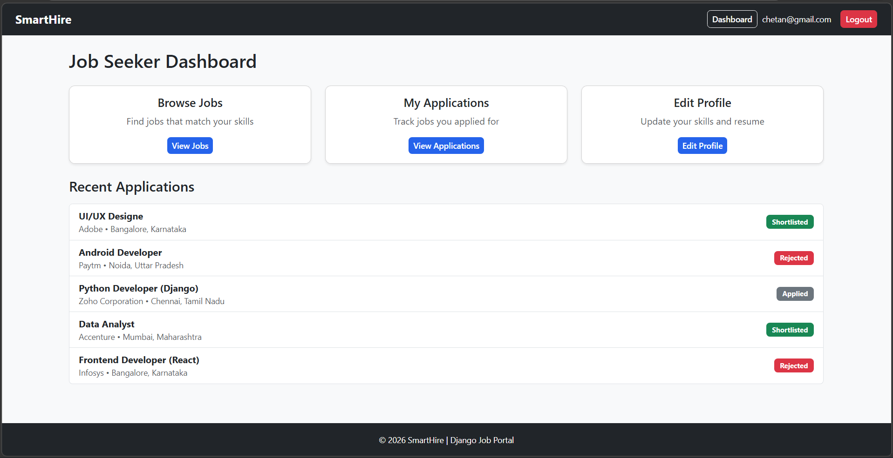
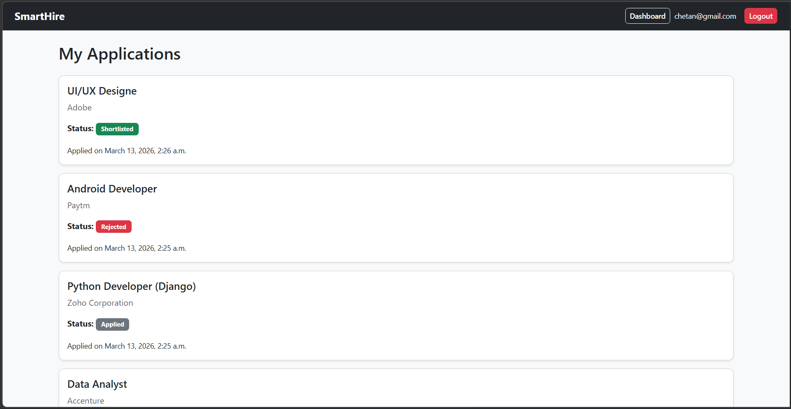
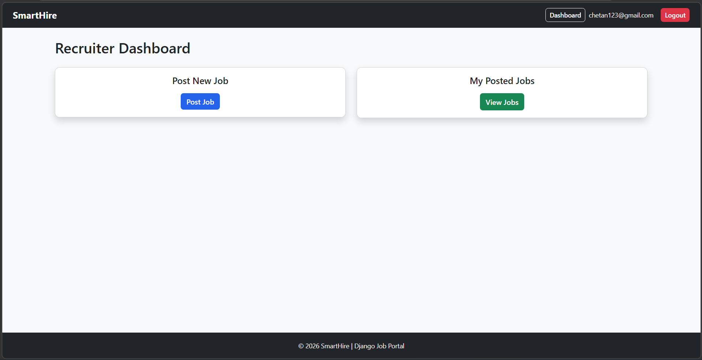
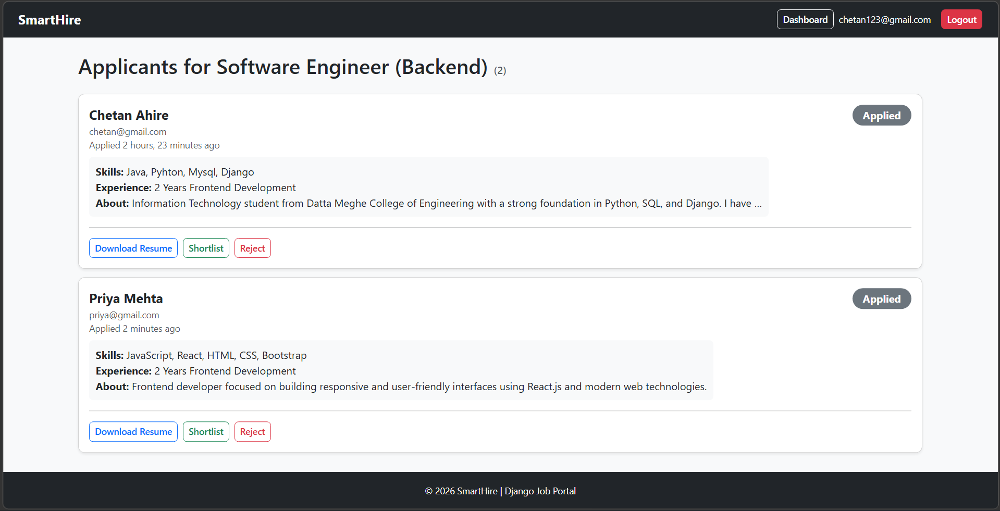
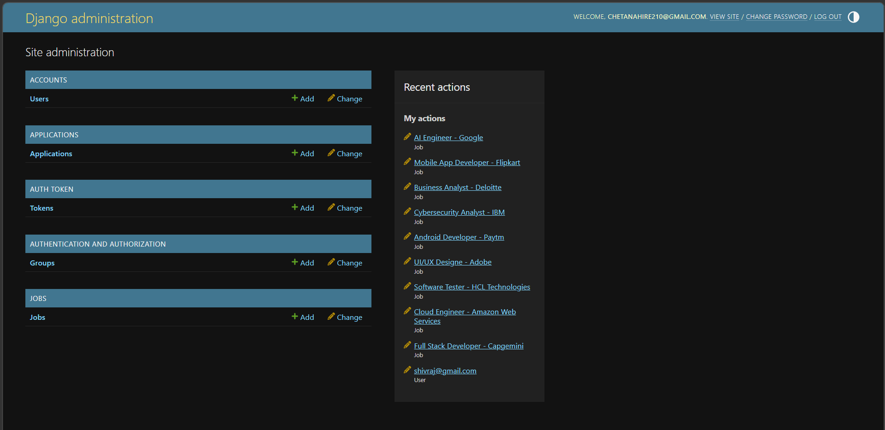

# SmartHire – Django Job Portal

SmartHire is a Django-based job portal designed to connect recruiters and job seekers through a streamlined hiring platform. Recruiters can post job listings and manage applicants, while job seekers can explore job opportunities, apply for positions, and track their application status.

The project demonstrates real-world backend development using Django and Django REST Framework, featuring role-based authentication, resume uploads, applicant tracking, and REST API integration.

---

# Project Overview

SmartHire allows two types of users to interact with the platform:

### Job Seekers

* Browse available job listings
* View job details
* Apply for jobs
* Upload resumes
* Track application status

### Recruiters

* Post job openings
* Manage posted jobs
* View applicants for each job
* Shortlist or reject candidates
* Automatically notify applicants via email

---

# Features

### Authentication

* Custom user model
* Email-based login
* Role-based access (Job Seeker / Recruiter)

### Job Management

* Recruiters can post job openings
* Admin approval for job listings
* Job search and filtering
* Pagination for job listings

### Application System

* Job seekers can apply for jobs
* Duplicate applications are prevented
* Recruiters can view applicants
* Recruiters can shortlist or reject candidates

### Profile System

* Job seeker profiles
* Skills and experience fields
* Resume upload support

### Notifications

* Email notifications when application status changes

### REST API

* Job listing API
* Job application API
* Token authentication
* Custom permissions

---

# Tech Stack

Backend

* Django
* Django REST Framework

Database

* SQLite (for development)

Frontend

* HTML
* Bootstrap 5
* Django Templates

Other Tools

* Django Signals
* Token Authentication
* SMTP Email Integration

---

# Project Structure

```
smarthire/
│
├── accounts/        # Authentication and user management
├── jobs/            # Job posting and job listings
├── applications/    # Job application management
├── api/             # REST API endpoints
│
├── templates/       # Base templates
├── screenshots/     # Project screenshots
├── media/           # Uploaded resumes
│
├── manage.py
└── smarthire/       # Project configuration
```

---

# Installation Guide

### 1 Clone the repository

```
git clone https://github.com/yourusername/smarthire-django-job-portal.git
cd smarthire-django-job-portal
```

---

### 2 Create virtual environment

```
python -m venv venv
```

Activate environment

Windows

```
venv\Scripts\activate
```

Mac/Linux

```
source venv/bin/activate
```

---

### 3 Install dependencies

```
pip install -r requirements.txt
```

---

### 4 Apply database migrations

```
python manage.py migrate
```

---

### 5 Create superuser

```
python manage.py createsuperuser
```

---

### 6 Run the server

```
python manage.py runserver
```

Open in browser:

```
http://127.0.0.1:8000
```

---

# API Endpoints

| Method | Endpoint              | Description         |
| ------ | --------------------- | ------------------- |
| GET    | /api/jobs/            | List available jobs |
| POST   | /api/jobs/            | Create new job      |
| POST   | /api/jobs/{id}/apply/ | Apply for job       |
| POST   | /api/login/           | API authentication  |

---

# Screenshots

## Job Listings Page

Users can browse available jobs posted by recruiters.



---

## Job Detail Page

Displays detailed job information including job description, required skills, salary, and apply option.



---

## Job Seeker Dashboard

Job seekers can manage their applications and update their profiles.



---

## My Applications Page

Shows all jobs the user has applied for along with the application status.



---

## Recruiter Dashboard

Recruiters can post new jobs and manage their job listings.



---

## Applicants Page

Recruiters can view applicants for a job and update their application status.



---

## Admin Panel

Django admin panel used to manage users, jobs, and applications.



---

# Future Improvements

* Allow recruiters to edit and delete their posted jobs
* Add profile picture support for job seekers
* Company profiles
* Advanced search filters
* Improve UI design for better user experience
* Deployment on cloud platforms

---

# Author

Developed by **Chetan Ahire**

Python & Django Developer
